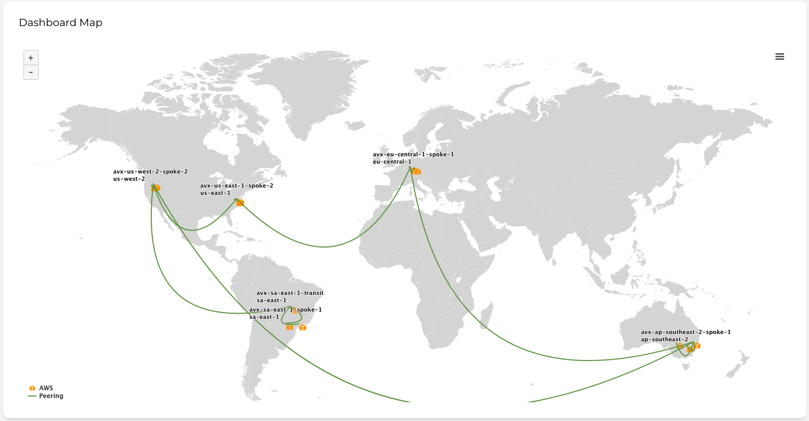
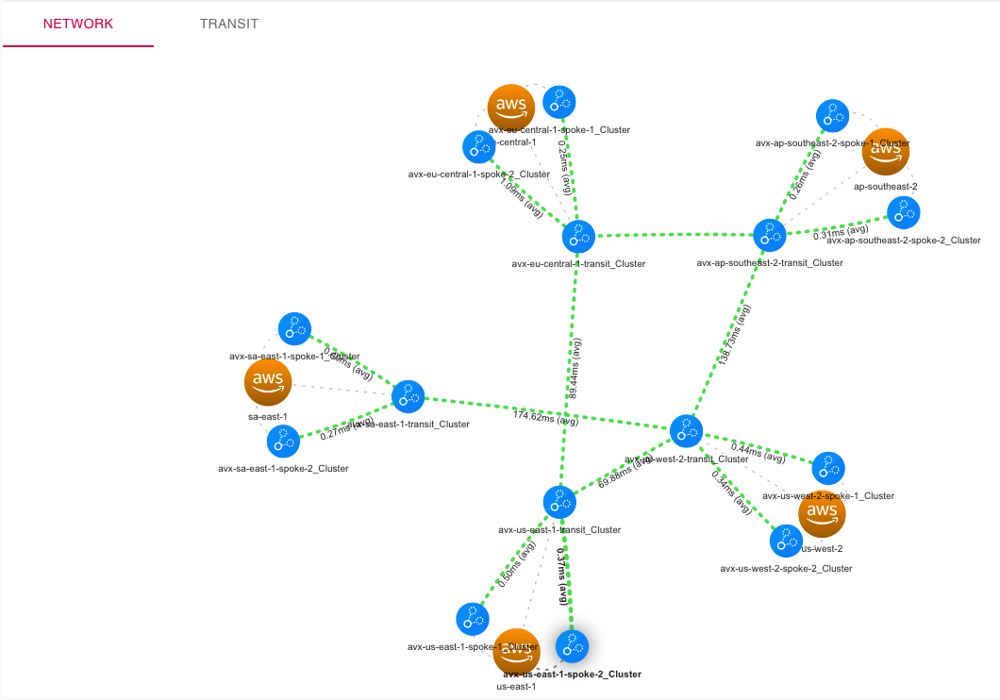

# aws-howdy-partner-twitch

Demonstration repository for the [AWS Howdy Partner](https://aws.amazon.com/blogs/apn/join-aws-solutions-architects-for-howdy-partner-twitch-series-featuring-apn-technology-partners/) Twitch session with Aviatrix.

## Infrastructure

These diagrams depicts the Aviatrix infrastructure used during the session.

 \

## Tools

This demostration featured:

- [GitHub Actions](https://github.com/features/actions)
- [Terraform Cloud](https://app.terraform.io)
- [The Aviatrix Terraform Provider](https://registry.terraform.io/providers/AviatrixSystems/aviatrix/latest/docs)

## Resources

- [Automate Terraform with GitHub Actions](https://learn.hashicorp.com/tutorials/terraform/github-actions)
